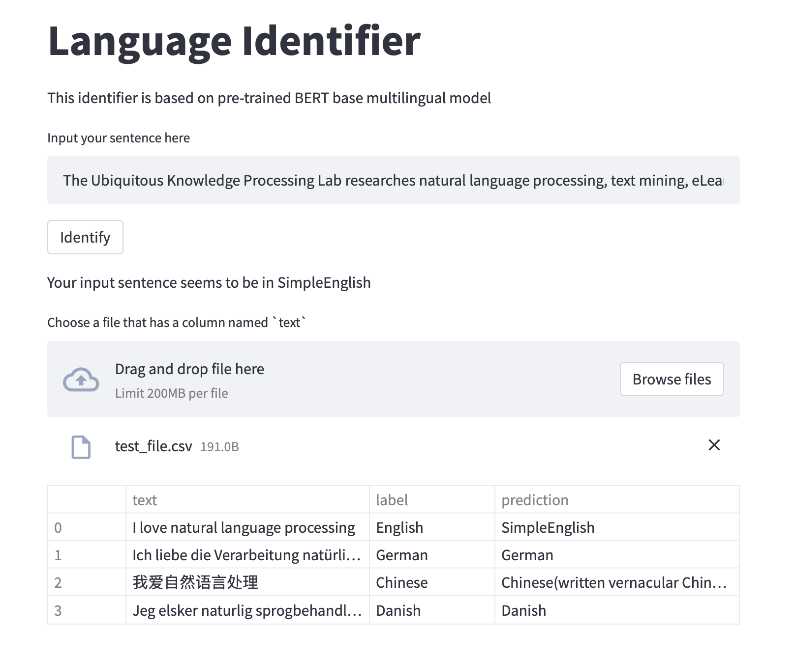

# Neural Language Identifier

## A language identifier that supports 100 languages. You can directly try the [identifier](https://5d7b-54-202-157-241.ngrok.io) online. (Online demo not functional at this time.)

## Implementation

Before running the scripts, make sure that you have all the dependencies installed:

```shell
pip install -r requirements.txt
```

### Data

All the data used in this experiment is collected from Wikipedia. I only collect the summaries of documents in different languages for the purpose of  controlling the data size. I assume that full text of documents are not necessary to the task of identifying language of sentences. Therefore, I crawl the [top 100 viewed topics](https://en.wikipedia.org/wiki/Wikipedia:Multiyear_ranking_of_most_viewed_pages) and [language list with wikipedia code](https://en.wikipedia.org/wiki/List_of_Wikipedias) to accommodate the data collection. With these topics and language codes, I collect data using Python library wikipedia:

```python
import wikipedia
wikipedia.set_lang(LANGUAGE_CODE)
wikipedia.summary(TOPIC)
```

Collect the data we use in our experiment by running:

```python
python data_prepare.py --topn 100
```

By setting topn, you can control how many kinds of languages you want to include in the data. Languages are sorted by the descending order as they are in [this page](https://en.wikipedia.org/wiki/List_of_Wikipedias), which follows the amount of active user base.

The cralwed data contains over 8300 sentences in 100 languages and I split (8:2) them as trainning set and evaluation set.

### Model

#### Version 1

I assume that to identify which language a sentence is in, the distributions of  types and orders of characters in sentences matter more than sentence level features such as attention weights between different tokens. Therefore, I choose LSTM as the backbone model rather than Transformer-based models.  The vocabulary is leveraged from the public [BERT base multilingual model](https://huggingface.co/bert-base-multilingual-cased) trained from Byte Pair Encoding for the ease of initialization. 

Evaluation accuracy of this model is 85% on over 300 sentences in a 100-class (100 different languages) task.

#### Version 2

Although the LSTM-based model can get an accuracy of 85% on the validation set, the version 1 model can not perform properly in generalizing to unseen characters during manual inference. Because the model is not completely trained to model the large word embeddings with a large vocabulary (110000+ characters) given only 6600 samples in 100 classes and 10 training epochs. To remedy this, we further use the [BERT base multilingual model](https://huggingface.co/bert-base-multilingual-cased) as our backbone and use the hidden states of '[CLS]' token as the sentence embedding to feed into a classifier.

Final evaluation accuracy of version 2 model is 94% on around 1700 sentences in the 100-class task (Find the results [here](./evaluation_result_with_acc_0.94.xlsx)). The model can also generalize well to handle unseen words in manual inference due to the learned knowledge in pre-training phase.

A demo run in the online app is:



## Anything that can improve

For version 1 model, the vocabulary size is around 110000 which leads to a large embedding parameter size, a plausible method is to use embedding-free algorithms such as [PRADO](https://aclanthology.org/D19-1506.pdf) or [pQRNN](https://arxiv.org/pdf/2101.08890.pdf).

